<p align="center">
  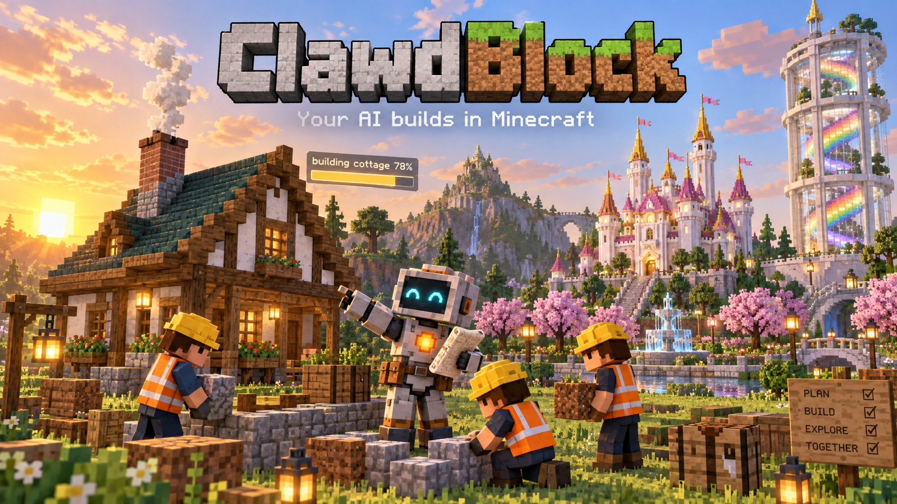
</p>

<p align="center">
  <b>Give your AI a body, hands and eyes in a Minecraft world — and the know-how to build like a pro.</b><br>
  One installer · an MCP server with 37 tools · a deep building skill · works with Claude, Gemini, Codex and local models
</p>

<p align="center">
  
  
  
  
  
</p>

---

You type *"build me a cottage next to the lake, with a garden"* — and in the game your AI's character walks over,
outlines the site, calls in a crew of helper builders in hard hats, and a furnished cottage with a smoking chimney
rises phase by phase under a progress bar. Then it checks its own work: every block where it should be, every room
reachable from the front door, no dark corners where mobs could spawn — and tells you where the door is.

**ClawdBlock** is everything that makes that possible:

- 🧰 **A cross-platform installer** — one command sets up a Minecraft 26.2 Fabric server with Carpet, recommended mods,
  RCON and the game-logic apps, and connects your AI client.
- 🤖 **An MCP server with 37 tools** — the AI's body (walks with pathfinding, opens doors, swings), hands (commands,
  generators, background jobs, helper builders), eyes (text vision, isometric / top-down / first-person renders,
  previews of builds that don't exist yet) and memory (a world map, people, a shared learning journal).
- 🛡️ **Safety rails** — automatic undo for every build, protected zones for other people's builds, an overwrite guard,
  verification after every job, and an access check that walks every room from the entrance.
- 📚 **A building skill** — golden rules and a step-by-step recipe a small model can follow, plus 31 reference pages
  (houses, roofs, stairs, furniture, interiors, styles, landscaping, water, towers, big projects, NPCs, game logic,
  redstone, verification, troubleshooting…) and hard-won lessons from real builds.
- 🏗️ **A building library and blueprints** — `mclib` + `parts` (furniture, roofs, stairs, windows, lamps, gardens,
  round towers, pools, flags) that work facing any direction, and eight ready blueprints to use and learn from.
- 🎮 **Game-logic apps** — launch pads, free-fall drops, timed races with record boards, a TNT Run arena game, a rideable Ferris wheel, vendor
  stands, secret doors, welcome shows, fireworks.
- 🎢 **A roller coaster that really runs** — a smooth steel track of display entities, a flame-painted train from a
  small resource pack and real gravity: ride it in first person up a chain lift, down a 67° drop and through a loop.
  Design and test your own layout in Python before building ([how it works](skill/clawdblock/reference/rides.md)).
- 🧩 **Game kit, cars and a HUD** — `gamekit.scl` gives any round-based minigame a join zone with a countdown, safe
  save/restore, eliminations, spectating, end screens and records (demo: Shrinking Ring); drivable GTA-style cars with
  drift physics and a chase camera; a HUD toolkit (speedometer, compass, timer, text anywhere on screen) that shares one
  shader with the minimap ([gamekit](skill/clawdblock/reference/gamekit.md) · [vehicles](skill/clawdblock/reference/vehicles.md) · [HUD](skill/clawdblock/reference/hud.md)).
- 🧪 **Developer tools for live servers** — `minecraft_app` lints scarpet apps for the traps that break them, patches a
  function live without a reload and reloads only when nobody is using the app; `minecraft_playtest` runs a scripted
  test with fake players in one call and cleans up after itself; `minecraft_pack` merges, validates and deploys the
  server resource pack ([guide](skill/clawdblock/reference/testing-apps.md)).
- 🩺 **A server watchdog** — finds what makes the server slow (entity piles, leaking apps that re-create the same
  entity, hot chunks, busy threads), tells the ops once, cleans only obvious junk, warns before the disk fills up, and
  makes safe rotating backups ([how to find lag](skill/clawdblock/reference/watchdog.md)).
- 🗺️ **A live minimap with no client mods** — a round map in the top-left corner for everyone, turning with your
  view, friends as dots; a resource pack + a scarpet app ([how it works](skill/clawdblock/reference/minimap.md)).

## Built by the included blueprints

Every picture below was built by the AI through ClawdBlock on a fresh test server, from the blueprints in
[`skill/clawdblock/blueprints/`](skill/clawdblock/blueprints) — and passed the automatic checks.

| | |
|---|---|
| 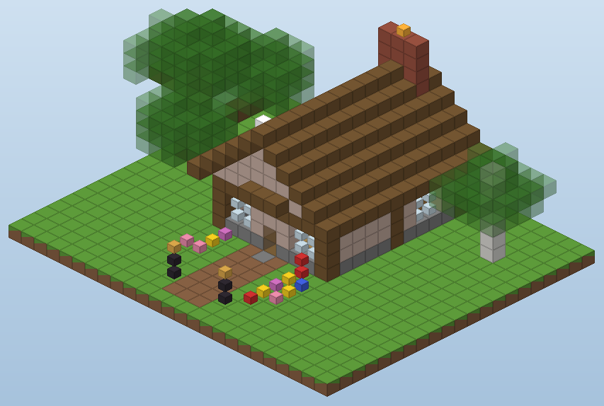<br>**Cottage** — timber frame, gable to the street, chimney smoke, garden with lamps and flower beds | 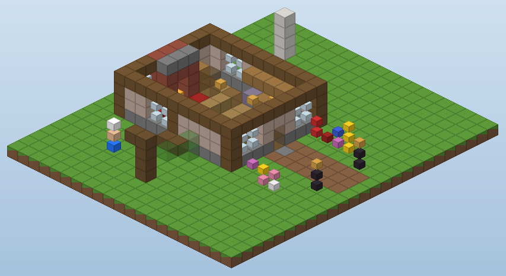<br>**…and inside** — fireplace, sofa and rug, kitchen, dining table, bed, bookshelves, lanterns from the ridge |
| 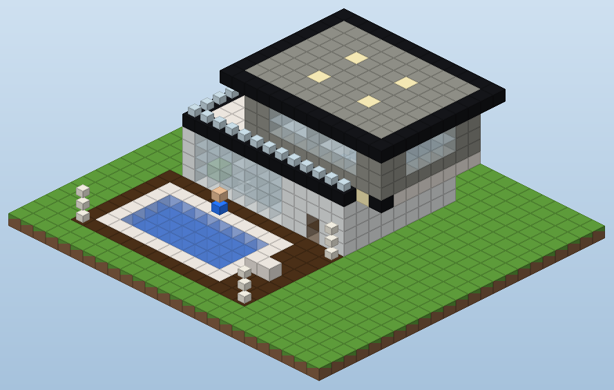<br>**Modern villa** — full-height glass wall, cantilevered upper floor, roof terrace, pool deck | 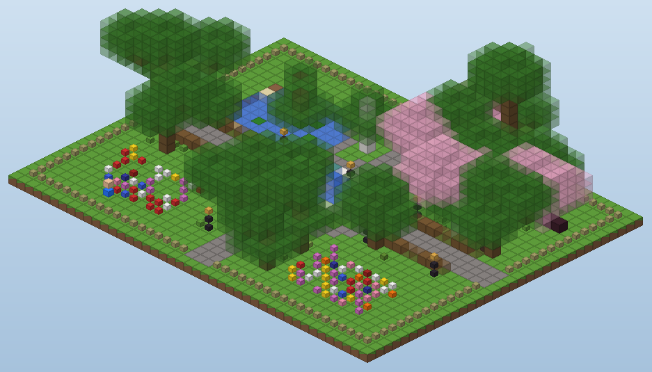<br>**Park** — walls and gates, gravel paths, fountain, pond, trees packed at random, benches, lamps |
| 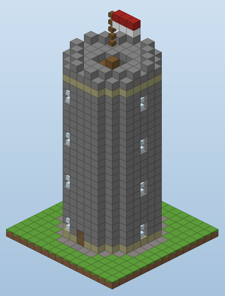<br>**Lookout tower** — spiral stairs through four storeys to a crenellated roof | 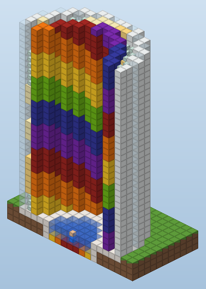<br>**Drop tower** — a launch pad flies you up, you free-fall down a colour spiral into a pool |

<details>
<summary><b>The component catalog</b> — one of every part, on labelled tiles (click)</summary>

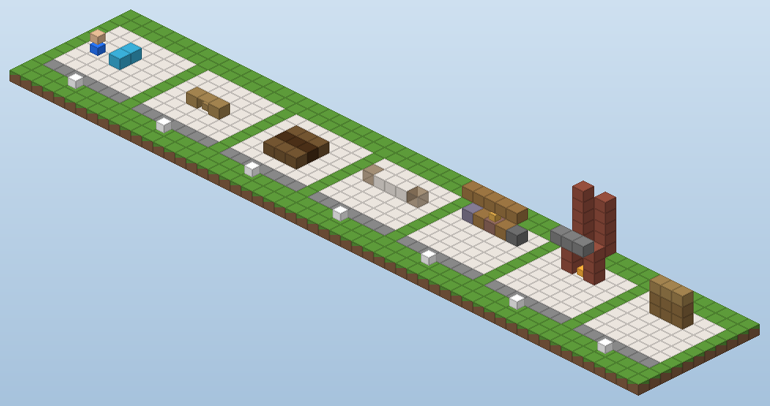
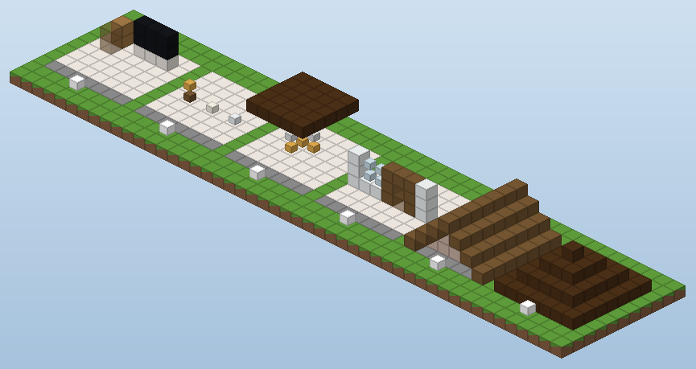
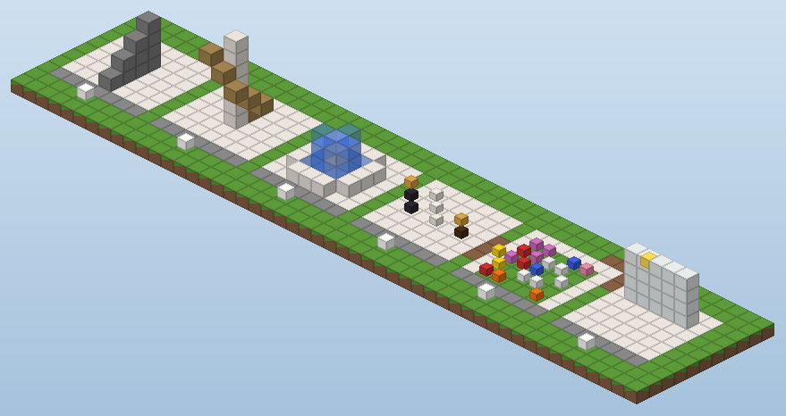
</details>

<details>
<summary><b>The same world with real textures</b> (BlueMap, optional)</summary>

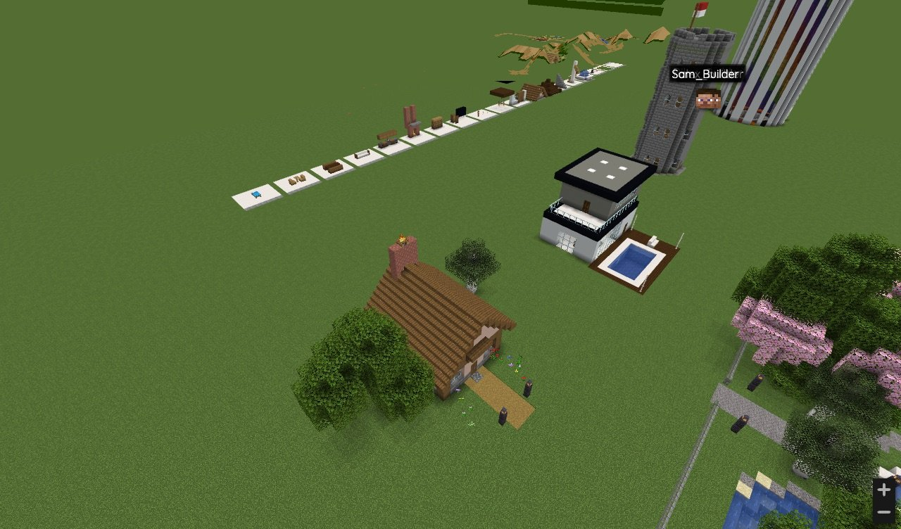
</details>

### Bigger projects

The same tools and skill, used over a few long sessions in a real creative world with friends — a fairytale palace
with grounds, a boat race track with a timing gantry and grandstand, a Central-Park-style park with a zoo:

| | |
|---|---|
| 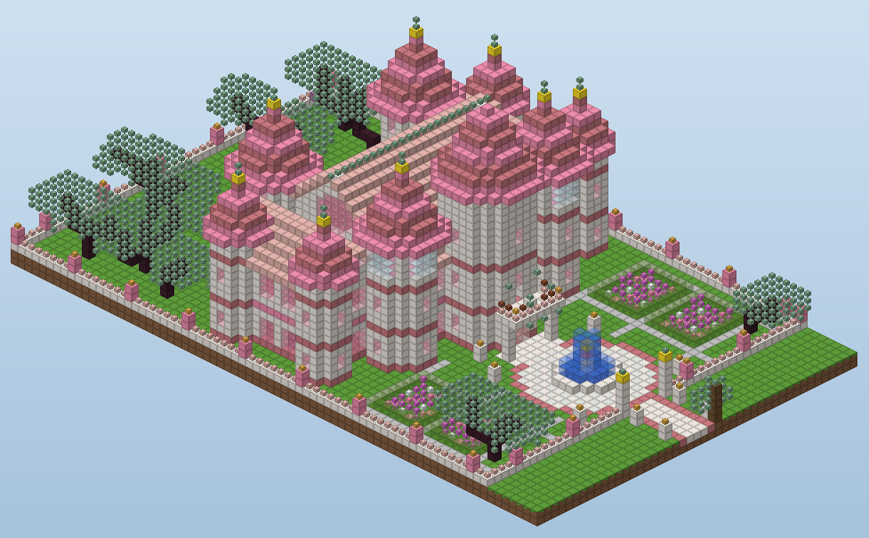 | 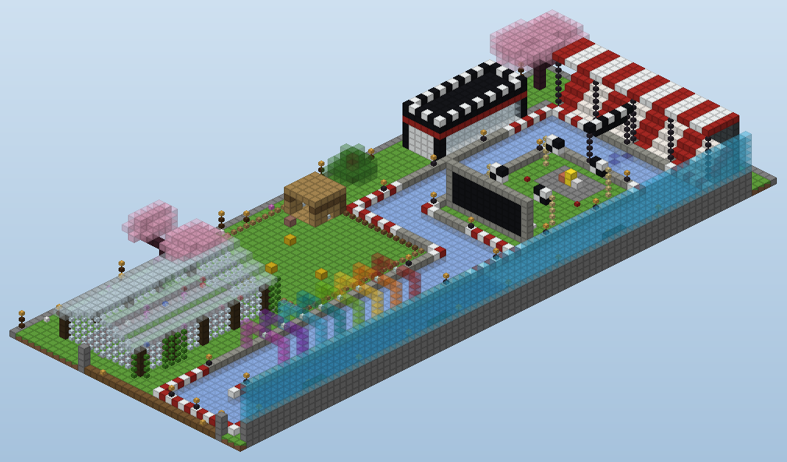 |
| 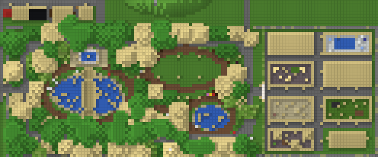 | |

*Renders are ClawdBlock's own flat-colour renderer — the same pictures the AI uses to look at its work.*

## Quick start

You need **Java 25**, **Node.js 20+** and **Python 3.9+** (the installer tells you exactly how to get any that are
missing), and the **Minecraft Java 26.2** client to play.

**macOS / Linux**
```bash
git clone https://github.com/sagistiki/clawdblock.git && cd clawdblock
./install.sh                     # interactive: server, mods, apps, MCP, your AI clients
python3 clawdblock.py start      # first start builds the world (~1 min)
```

**Windows** — download the repo (Code → Download ZIP, or `git clone`), then double-click **`install.cmd`**, then
run `clawdblock start` in that folder.

Join `localhost` in Minecraft 26.2, make yourself op in the server console (`op <your name>`), open your AI in the
`clawdblock` folder and say hi. Details: [docs/getting-started.md](docs/getting-started.md).

| Your AI | Connect with | Guide |
|---|---|---|
| Claude Code | `python3 clawdblock.py connect claude-code` | [docs/clients/claude-code.md](docs/clients/claude-code.md) |
| Claude Desktop | `python3 clawdblock.py connect claude-desktop` | [docs/clients/claude-desktop.md](docs/clients/claude-desktop.md) |
| Gemini CLI | `python3 clawdblock.py connect gemini` | [docs/clients/gemini-cli.md](docs/clients/gemini-cli.md) |
| Codex CLI | `python3 clawdblock.py connect codex` | [docs/clients/codex.md](docs/clients/codex.md) |
| LM Studio / local models / any MCP client | `python3 clawdblock.py connect lmstudio` or `connect print` | [docs/clients/local-models.md](docs/clients/local-models.md) |

## Things to say

- *"Spawn in and build me a cottage right next to me."*
- *"Look at my house and tell me what you'd improve."*
- *"Find a free spot near the park and build a lookout tower. Bring the crew."*
- *"Give me 10 ideas to upgrade the town square — I'll pick."*
- *"Make the bar actually serve drinks when I press the button."*
- *"Build a race course with checkpoints and a record board."*
- *"That door is stuck — fix it."* / *"Undo the last build."*

## How it works

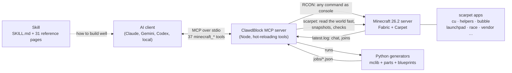

No protocol bot, no client mods: the MCP drives the server through **RCON** (so it works on any Minecraft version the
mods support), gives the AI a visible body with Carpet's **fake players**, and reads the world with Carpet's
**scarpet** — a whole 100k-block region in one call. Builds are written as Python **generators** (voxels → compressed
`/fill` commands) and run as **background jobs** with a boss bar, helper builders, an undo snapshot and automatic
verification. More: [docs/architecture.md](docs/architecture.md).

## What's in the box

| Path | What |
|---|---|
| [`clawdblock.py`](clawdblock.py) | setup · start · stop · status · doctor · mods · apps · connect · new-world · backup (rotation, refuses without room) (stdlib Python) |
| [`install.sh`](install.sh) / [`install.cmd`](install.cmd) / [`install.ps1`](install.ps1) | installers that check prerequisites and run setup |
| [`mcp-server/`](mcp-server) | the MCP server: `index.js` core, `lib/` shared helpers, `tools/` tool groups, renderer, pathfinder, simulator |
| [`skill/clawdblock/SKILL.md`](skill/clawdblock/SKILL.md) | the skill: golden rules, the recipe, tools at a glance, facts that break builds |
| [`skill/clawdblock/reference/`](skill/clawdblock/reference) | 31 deep-dive pages |
| [`skill/clawdblock/scripts/`](skill/clawdblock/scripts) | `mclib.py`, `parts.py`, `city.py` (roads, rail lines), and the helper scarpet apps |
| [`skill/clawdblock/blueprints/`](skill/clawdblock/blueprints) | cottage, modern villa, tower, park, drop tower, TNT Run arena, Ferris wheel, roller coaster, catalog |
| [`skill/clawdblock/SYSTEM_PROMPT.md`](skill/clawdblock/SYSTEM_PROMPT.md) | a condensed prompt for small / local models |
| [`scarpet-apps/`](scarpet-apps) | launchpad, race, tntrun, ferris, minimap, vendor, secret_door, welcome, fireworks, cars, ring (+ `gamekit.scl`, `hud.scl`), watchdog |
| [`skill/clawdblock/blueprints/coaster/`](skill/clawdblock/blueprints/coaster) | a roller coaster: track + physics, builder, train pack, ride app, layouts |
| [`resourcepacks/`](resourcepacks) | minimap, HUD toolkit, car models, and `tools/model_preview.py` (render item/block models to PNG without a game client) |
| [`mods-src/keybridge/`](mods-src/keybridge) | Key Bridge, a tiny server-side Fabric mod: movement keys → scoreboard for scarpet apps, and `/packpush` to send a new resource pack to everyone live |
| [`docs/`](docs) | getting started, clients, friends, architecture, troubleshooting, contributing, writing blueprints |

## Mods

| Mod | | Why |
|---|---|---|
| Fabric API, **Carpet** | required | Carpet gives the AI its body (fake players) and scarpet (fast world reads, undo, checks) |
| Lithium, WorldEdit, BlueMap, Essential Commands, spark | recommended | performance · big edits · a 3D web map + real-texture screenshots · warps · lag profiling |
| Chunky, Polydecorations (+Polymer), Ledger, Carpet Extra | optional | pre-generation · server-side furniture · rollback logs · extra rules |
| Key Bridge (built from `mods-src/keybridge`) | optional | movement keys for scarpet vehicles and rides; live resource-pack push |

All downloaded from Modrinth by the installer for your Minecraft version; `python3 clawdblock.py mods` adds or removes
them later. Tools that need a missing mod hide themselves. Players need **no** client mods.

## Honest limits

- The AI sees through renders and text, not the game client: renders are flat-coloured and draw stairs as cubes.
  It verifies block states by reading them.
- Building is fast (a 2,000-command tower phase takes seconds), but a big project is still a conversation: the AI
  surveys, plans, previews, builds in phases and checks — minutes, not one click.
- Everything is tested on Minecraft **26.2**; newer versions usually work once Carpet supports them
  ([docs/upgrading.md](docs/upgrading.md)).
- Small local models do best with the blueprints and `SYSTEM_PROMPT.md`; free-form architecture needs a strong model.

## Contributing

New blueprints, parts, scarpet apps, reference pages and lessons are very welcome — see
[docs/contributing.md](docs/contributing.md) and [docs/writing-blueprints.md](docs/writing-blueprints.md).
Found a lesson the hard way? That's exactly what [`reference/lessons.md`](skill/clawdblock/reference/lessons.md) is for.

## Credits

- **Idea, design and direction:** [@sagistiki](https://github.com/sagistiki)
- **Built with:** Claude Opus 5.5 (Anthropic) — code, skill, blueprints and docs, pair-built live in a real server
- **Banner:** generated with OpenAI `gpt-image-2.5` via Replicate
- Standing on the shoulders of [Fabric](https://fabricmc.net), [Carpet](https://github.com/gnembon/fabric-carpet),
  [BlueMap](https://bluemap.bluecolored.de), [WorldEdit](https://enginehub.org/worldedit) and the
  [Model Context Protocol](https://modelcontextprotocol.io)

## License

[MIT](LICENSE). ClawdBlock is a fan project — not affiliated with or endorsed by Anthropic, Mojang Studios or
Microsoft. Minecraft is a trademark of Mojang Studios.
