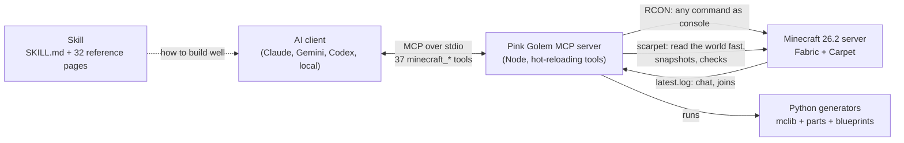
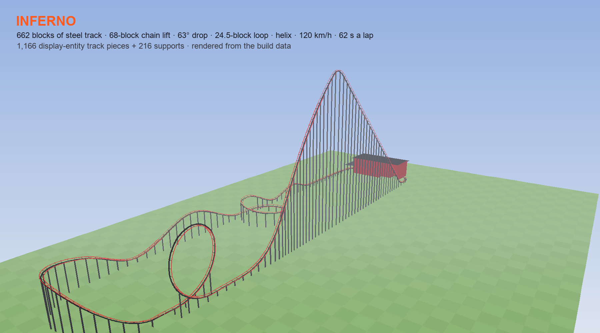

<p align="center">
  
</p>

<p align="center">
  <b>Give your AI a body, hands and eyes in a Minecraft world — and the know-how to build like a pro.</b><br>
  One installer · an MCP server with 37 tools · a deep building skill · works with Claude, Gemini, Codex and local models
</p>

<p align="center">
  
  
  
  
  
</p>

---

You type *"build me a cottage next to the lake, with a garden"*. Your AI's character walks over, outlines the site,
calls in a crew of helper builders, and a furnished cottage rises phase by phase. Then it checks its own work (every
block, every room reachable from the door, no dark corners) and tells you where the door is.

## What it can do

| | |
|---|---|
| 🏗️ **Build** | houses, towers, parks, whole districts, from blueprints or its own generators, with undo, protected zones and automatic checks |
| 🎮 **Make it playable** | minigames with rounds and records, races, a rideable Ferris wheel and roller coaster, drivable cars |
| 🗺️ **Draw on screen, no mods** | a live minimap and a HUD (speedometer, compass, timers) from a resource pack |
| 🩺 **Run a live server** | test apps with fake players, patch them without a reload, find what lags, back up safely |
| 📚 **Know how** | a building skill with golden rules and 32 reference pages, for strong and small models alike |
| 🔒 **Safe with strangers** | players are owners or guests; guests can't unlock generators or admin commands, enforced in code ([SECURITY.md](SECURITY.md)) |

**[Everything, with links →](docs/features.md)**

## Built by the included blueprints

| | |
|---|---|
| <br>**Cottage**: timber frame, chimney smoke, garden | <br>**…and inside**: fireplace, kitchen, bed, lanterns |
| <br>**Modern villa**: glass wall, roof terrace, pool | <br>**Park**: paths, fountain, pond, benches, lamps |
| <br>**Lookout tower**: spiral stairs, four storeys | <br>**Drop tower**: fly up, free-fall into a pool |

<details>
<summary><b>More pictures</b>: the parts catalog, bigger projects, real textures</summary>


Built over a few long sessions in a real world with friends: a fairytale palace, a boat race track, a park with a zoo.


</details>

*Renders are Pink Golem's own flat-colour renderer: the same pictures the AI uses to look at its work.*

## Quick start

You need **Java 25**, **Node.js 20+**, **Python 3.9+** (the installer tells you how to get any that are missing) and
the **Minecraft Java 26.2** client.

```bash
git clone https://github.com/sagistiki/pink-golem.git && cd pink-golem
./install.sh                     # server, mods, apps, MCP, your AI clients   (Windows: double-click install.cmd)
python3 pinkgolem.py start      # the first start builds the world (~1 min)
```

Join `localhost`, make yourself op (`op <your name>` in the server console), open your AI in the `pinkgolem` folder
and say hi. Setup for each AI (Claude Code, Claude Desktop, Gemini CLI, Codex, local models): **[getting started →](docs/getting-started.md)**

## Things to say

- *"Spawn in and build me a cottage right next to me."*
- *"Look at my house and tell me what you'd improve."*
- *"Find a free spot near the park and build a lookout tower. Bring the crew."*
- *"Make the bar actually serve drinks when I press the button."*
- *"Why is the server lagging?"*

## How it works



There's no protocol bot and no client mods. The MCP drives the server through RCON, gives the AI a visible body with
Carpet's fake players, and reads the world with scarpet. **[Architecture →](docs/architecture.md)**

## Honest limits

- The AI sees through renders and text, not the game client. It verifies what it can't see by reading block states
  or asking you to look.
- A big project is a conversation (survey, plan, preview, build in phases, check): minutes, not one click.
- It's tested on Minecraft **26.2**; newer versions usually work once Carpet supports them ([upgrading](docs/upgrading.md)).
- Small local models do best with the blueprints; free-form architecture needs a strong model.

## Case study: a roller coaster that really runs

<p align="center"></p>

A player asked for *"an amazing roller coaster, with a loop and a real coaster feeling"*. The result:
- a 662-block steel track with a 68-block lift, a loop and a helix;
- designed in Python with real physics before a single block was placed;
- built from display entities;
- ridden in first person, upside down through the loop.

**[How it was built, bugs and all →](docs/case-study-roller-coaster.md)**

## More

[All docs](docs/README.md) · [Features, layout and mods](docs/features.md) · [Contributing](docs/contributing.md) ·
[Writing blueprints](docs/writing-blueprints.md) · [Lessons learned the hard way](skill/pinkgolem/reference/lessons.md)

**Credits:**
- Idea, design and direction by [@sagistiki](https://github.com/sagistiki).
- Built with Claude Opus 5.5 (Anthropic), pair-built live on a real server.
- Banner generated with Google `nano-banana-pro` via Replicate.
- Standing on [Fabric](https://fabricmc.net), [Carpet](https://github.com/gnembon/fabric-carpet),
  [BlueMap](https://bluemap.bluecolored.de), [WorldEdit](https://enginehub.org/worldedit) and the
  [Model Context Protocol](https://modelcontextprotocol.io).

Formerly **ClawdBlock** (renamed in September 2026; see [CHANGELOG](CHANGELOG.md)).

[MIT](LICENSE). A fan project, not affiliated with or endorsed by Anthropic, Mojang Studios or Microsoft. Minecraft is
a trademark of Mojang Studios.
