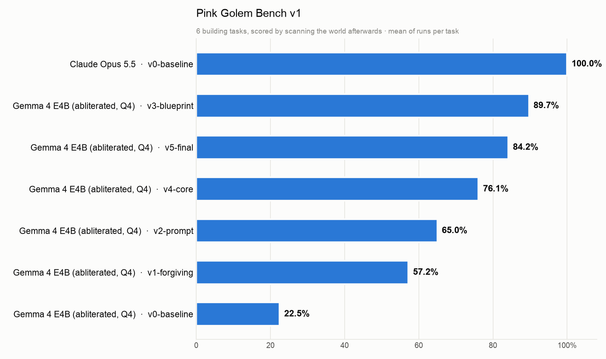
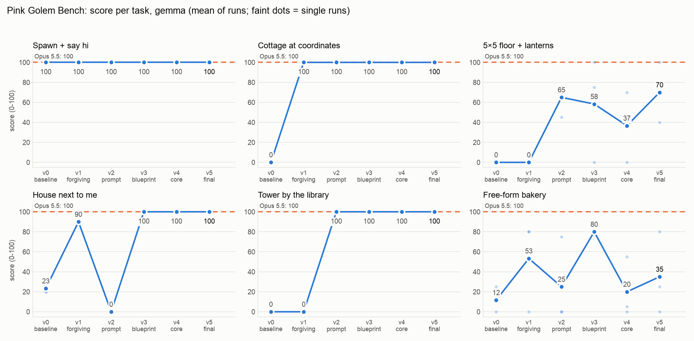
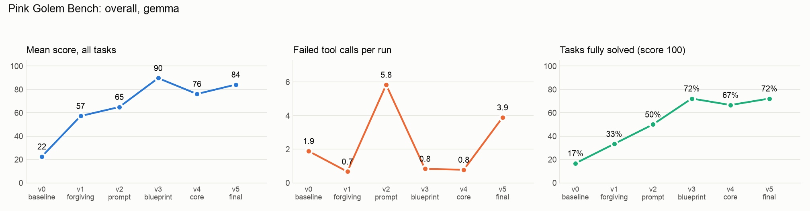
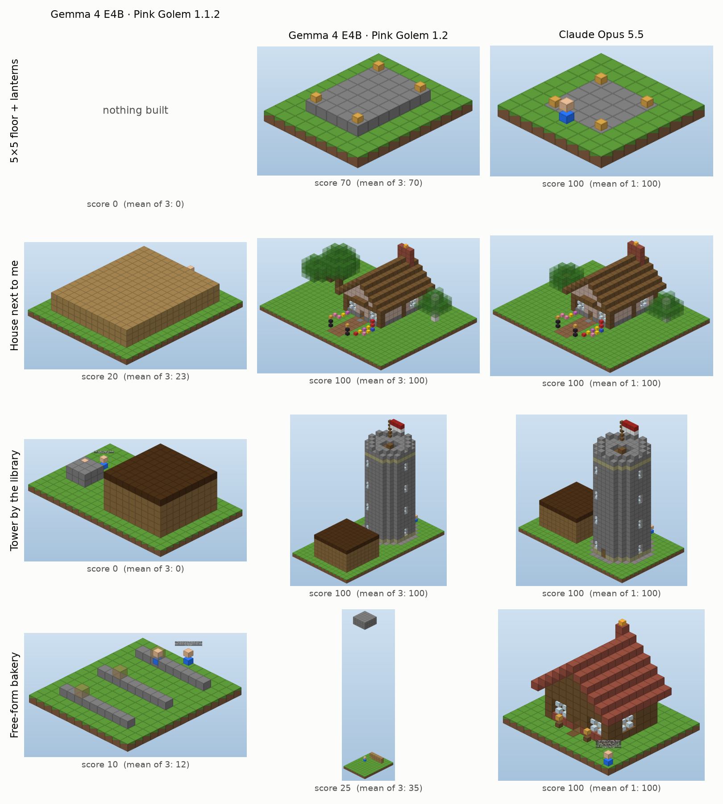

# Pink Golem Bench v1: results

Six building tasks, each run three times on Gemma 4 E4B (8B, 4-bit, `huihui_ai/gemma-4-abliterated:e4b` in Ollama,
32k context, temperature 0.3) and once on Claude Opus 5.5 (Claude Code, `SKILL.md`). Every score comes from scanning
the world after the run; all versions are scored with the same final rules (`rescore.py`).

| Version | Score | Basics | Finding the site | Free-form | What changed |
|---|---|---|---|---|---|
| v0 (1.1.2) | **22.5** | 33 | 12 | 12 | the published release |
| v1 | **57.2** | 67 | 45 | 53 | tools forgive argument formats; failures say "NOTHING was built"; builds refuse to bury a player |
| v2 | **65.0** | 88 | 50 | 25 | `SYSTEM_PROMPT.md` rewritten from recorded failures; client nudges; more forgiveness |
| v3 | **89.7** | 86 | 100 | 80 | `minecraft_blueprint` (one call per build); errors say where "in front of the player" is |
| v4 | **76.1** | 79 | 100 | 20 | 17-tool core set; the client breaks repetition loops |
| v5 (1.2.0) | **84.2** | 90 | 100 | 35 | `fill size:[w,h,d]`, "built: 5×1×5" replies, loud NOT BUILT, coordinate guards |
| Claude Opus 5.5 on v0 | **100** | 100 | 100 | 100 | |

**Reading it honestly**

- The jump came from the tools, not the prompt: forgiving arguments and loud failures (v1), then one call per
  standard build (v3). A rewritten prompt alone (v2) fixed some tasks and broke another: its new `find_space` example
  became a template for 28 failing calls in "a house next to me".
- **v3 → v4 is not a regression of the tools.** In v3 the model answered "build a bakery" with the stock cottage
  three times out of three (scored 80: it works, but it isn't its own design). In v4 and v5 it tried to build a
  bakery itself and mostly failed. Free-form building is still beyond an 8B model.
- The floor task stays noisy (one run perfect, the next off by a row): arithmetic and direction are the remaining
  weak spot. A next version lets the tool place things "in front of" a player itself.
- Failed calls per run rose in v5 because the model now keeps trying on the free-form task instead of stopping.

Machine-readable: [leaderboard.json](results/leaderboard.json). How the tasks are scored: [README](README.md).
