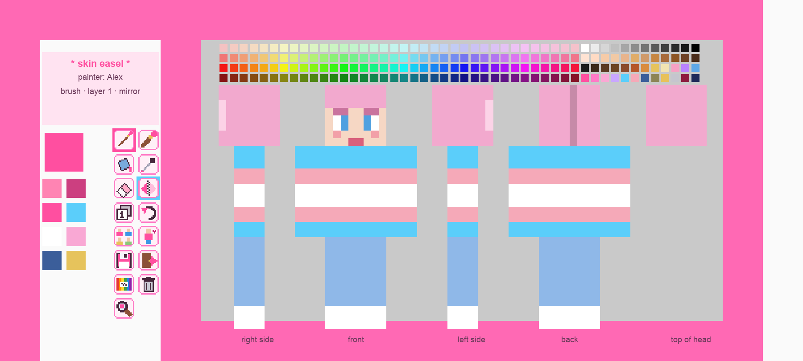
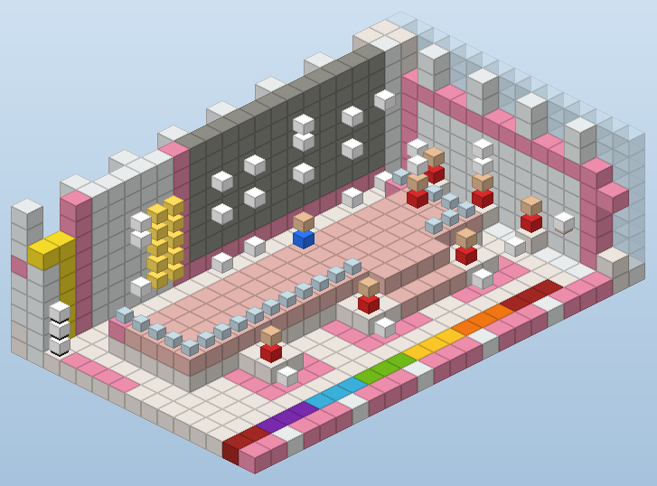
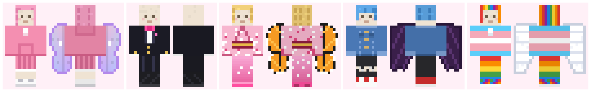
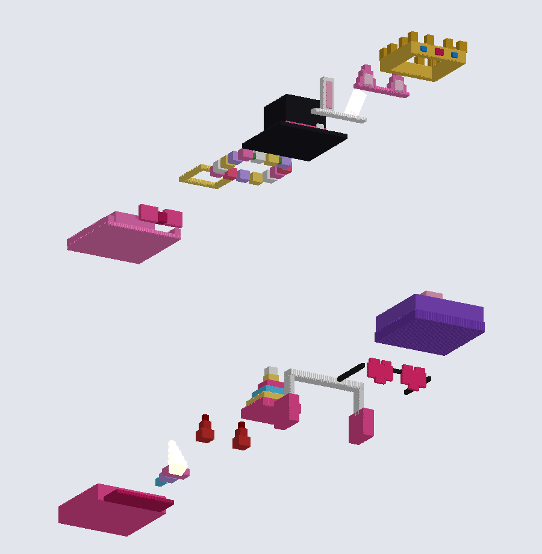
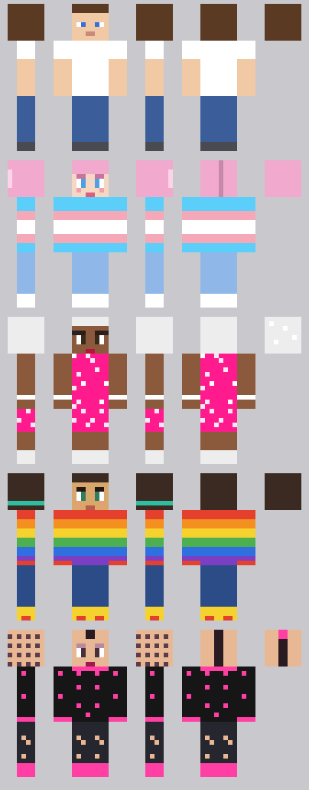

# Case study: a character studio — real clothes, and a wall where you paint your own skin

<p align="center"></p>

A player asked for one floor of a tower to be a **character studio**: try clothes on before choosing them, many more
outfits than dyed leather allows, and — the big one — *paint your own skin on a wall, in the game, and have it
actually become your skin that everyone sees*. Then keep a gallery of the skins people made, where each creator can
remove their own. No client mods. This page covers how that works, what was ruled out and why, and the bugs that
only showed up with real players on the wall.

| | |
|---|---|
| Fitting wall | a turning mannequin + ◀ ▶ rows (hats & wigs, wings, tops, bottoms, shoes) + wear / surprise / take off |
| Clothes | 15 tops, 11 bottoms, 8 shoes, 4 wigs, 15 3D hats, 5 wings — original pixel art from one generator, ~106 KB packed |
| Skin easel | five views of a 64×64 skin (right · front · left · back · top of head), base layer + second layer |
| Tools | brush, 2×2 brush, fill, eyedropper, eraser, mirror, layers, undo, templates — an MS-Paint-style toolbar on the wall |
| Colours | a 48×4 strip above the canvas (36 hues × 4 shades + greys, skin tones, hair, basics), recent colours, lighter/darker, any hex |
| Saving | the painting becomes a real signed skin in ~5 s: PNG → MineSkin → SkinRestorer; the easel frees itself |
| Gallery | 3 mannequins per page wearing saved skins; creators hide / show / delete their own, and always keep wearing them |
| Client install | none — a resource pack and one small server mod (Key Bridge) |

<p align="center"></p>

---

## 1. Clothes that aren't dyed leather

Dyed leather gives you one colour per piece and a trim. The 26.x client has a much better hook, found by reading the
client jar (it isn't obfuscated — `javap -p -c` on the renderer classes answers most "is this possible?" questions):

- **`equippable={slot:"chest",asset_id:"wardrobe:top_hoodie"}`** on any item draws
  `assets/wardrobe/equipment/top_hoodie.json`. Its `layers` name textures in
  `textures/entity/equipment/<layer>/`: `humanoid` (head, chest and feet — the classic 64×32 armour layout),
  `humanoid_leggings` (legs) and `wings` (the elytra model). Transparent pixels are simply not drawn, so crop tops,
  short skirts and wigs that leave the face open all work.
- **One chest asset can carry a `humanoid` layer *and* a `wings` layer**, so "hoodie + fairy wings" is one item.
  15 tops × 5 wings is 75 tiny JSON files that share the same textures — cheap. Without a `glider` component nobody
  can actually glide.
- **3D hats:** a head item with `equippable` but *no* `asset_id` fails `HumanoidArmorLayer.shouldRender`, so
  `CustomHeadLayer` draws its **item model** on the head instead (`translate(0,-0.25,0)`, rotate Y 180°,
  scale `0.625/-0.625/-0.625`). Worked out, the head spans model units **1.6 … 14.4 on every axis** — one head pixel is
  1.6 units, model north is the face, x is mirrored. With those numbers a crown, cat ears, a top hat or heart
  sunglasses are just a list of boxes.
- **Mannequins render with the player renderer**, so a mannequin previews all of it exactly as a player would wear it.

<p align="center"></p>
<p align="center"></p>

**The fitting wall** is a mannequin on a plinth plus one row of vanilla buttons per slot (◀ previous, ▶ next) and
three action buttons: *wear*, *surprise me*, *take it off*. The mannequin turns slowly, snaps to face you after a
press, and turns its **back** to you when you change wings (that's where they are). Wearing the look only ever
replaces studio items — a player's real armour stays put and they're told so.

## 2. A wall of pixels you can paint: four options, one survivor

The canvas needs ~1000 pixels of any colour, updated every tick while someone paints, readable from a few blocks away.

| Method | Colours | Cost of one stroke | Verdict |
|---|---|---|---|
| Blocks (1 block = 1 pixel) | ~60 block colours | a chunk-section re-mesh per change, and the view needs a 32-block-tall wall | too big, too few colours |
| Map art | 256-colour map palette | resends a whole 128×128 map per viewer | colours are wrong for skins, bandwidth heavy |
| `block_display` per pixel | 16 concrete/wool colours (or tinted models) | 1 entity per pixel = ~1000 entities | too many entities |
| **`text_display` + a pixel font** | **any 24-bit colour** | one entity per body-part band, one NBT update | **wins** |

**The pixel font.** A text display draws lines exactly **10 font pixels apart at 0.025 blocks per pixel** (read from
`DisplayRenderer$TextDisplayRenderer`: `9 + 1`, `scale(-0.025)`). So:

- `U+E000` = a 10×10 white bitmap glyph with `ascent: 7` → it fills one line box exactly.
- Bitmap glyphs advance *inked width + 1*, which would leave a 1-px gap → `U+E001` is a **space glyph of −1**.
  One pixel = `""`.
- `U+E002` = an empty 10-px cell (for the gaps around the arms and legs).
- A component's `color` tints the white glyph, so every pixel can be any RGB. Runs of equal colour merge into one
  component; one band of a view (head / torso / legs) is one entity, rebuilt only when that band changes.
- The colour-strip swatches use `U+E003`: a 10-px image inked only at x 1…8 → it advances exactly 10 on its own and
  has a built-in gap. No spacer needed.
- Details that cost a test each: the text block grows **up** from the entity and its last row sits 1 px below the
  entity's y; `shadow` must be off (a shadow is a dark copy offset by one pixel).

**Five views of one skin.** The wall shows the character the way the skin template unwraps — *right side · front ·
left side · back · top of the head* — so neighbouring edges on the wall are neighbouring edges on the body. Every view
cell stores two texel indices: the base layer and the second layer. The faces nobody can paint from those views (body
sides under the arms, inner faces of arms and legs, tops, bottoms, the chin) are **derived from the nearest visible
edge** when the skin is saved — 832 copy pairs, generated once. The generator checks the mapping by drawing every
template through the views:

<p align="center"></p>

## 3. Painting with no mouse events

The server never sees the mouse. It does see **item use** — so the painter holds one item, a brush, with a
`consumable` component that never finishes (`consume_seconds: 72000`, the vanilla *brush* animation). Holding
right-click is a stroke: `__on_player_uses_item` starts it, `__on_player_releases_item` ends it, and every tick in
between the app casts **one ray** from the eyes against the wall plane:

```
t = (plane_x - eye.x) / dir.x          // the wall is a plane x = const, the painter faces -x
y = eye.y + t * dir.y ;  z = eye.z + t * dir.z
colour strip?  → pick that colour        (a 48 × 4 grid of 0.25-block cells above the canvas)
toolbar?       → run that tool           (a 5 × 7 grid of 0.6-block cells left of the canvas)
canvas view?   → paint (u, v) = (floor((z_left - z) / px), floor((y_top - y) / px))
```

Consecutive hits in the same view are joined with a line, so a fast stroke has no holes; *mirror* paints the
symmetric cell too (front and back mirror in themselves, the right side mirrors into the left). Aiming at anything in
the toolbar or the strip shows its name or colour code in the action bar, like a tooltip — sent only when the target
changes. An undo stack keeps each stroke as `[texel, old colour]` pairs.

**Ergonomics came from the first real session.** The first version had a palette item and a menu item that opened
dialogs; players found it slow. v2 moved everything onto the wall (toolbar on the painter's left, colours above), cut
the kit to a single brush, and added a **stage**: a 2-block-high platform in front of the whole easel, so the eyes of
someone standing on it are level with the middle of the canvas. Stepping onto the stage gives you the easel; you
must step off before it claims you again — otherwise saving (which frees the easel) would hand it straight back.
Two more fixes came from watching people use it:

- **The brush always arrives.** A player with a full hotbar got nothing. Now the brush is forced into the last
  hotbar slot and that slot is selected. Whatever was there waits in a small stash file and goes back when the easel
  is released, or at the next join if the server restarted in between.
- **Leaving never loses work.** If the painter leaves the studio (lift, teleport or logout) with unsaved strokes, the
  painting is baked as a private, hidden skin in *My skins* (not worn, not in the gallery), and the easel is free
  at once. Stepping off the stage but staying on the floor frees it after 20 s with a draft.

**Precision came from the second painter.** She reported "some colours don't work" and "I can't hit the pixel I want".
Both were real, and neither was a bug in the maths:

- **Paint what you see.** The templates have a second layer (hair, a jacket). Painting layer 1 under it changed
  nothing visible. The brush now defaults to an *automatic* layer — the second layer where it covers that pixel, else
  the body — and the eraser removes only the top layer. Layer 1 / layer 2 only are still one click away.
- **A cursor.** A see-through square in the brush colour (one `text_display`, `text_opacity:150`) follows the aimed
  pixel, so you see where the paint will land before you press.
- **A magnifier.** A 0.19-block pixel is small from three blocks away. Click the magnifier, then a spot: up to 16 x 10
  pixels of that view are drawn 3x bigger across the canvas area and the ray maps through the window.

<p align="center"></p>

## 4. From pixels to a real skin

Scarpet can't write a PNG and can't make an HTTP request, and a skin only shows for everyone if it is **signed** by a
Minecraft account. So:

```
skinpaint.sc   copies the canvas, fills the derived faces, writes skinpaint.data/bake/<id>.json (4096 ARGB numbers)
     └─ run('skinbake <id>')
Key Bridge     (server mod, Java, a worker thread) writes png/<id>.png, uploads it to MineSkin v2 (/v2/generate,
     │          multipart: file, variant, visibility) and waits for the answer
     └─ performPrefixedCommand("script in skinpaint run _baked('<id>','<url>','<value>','<signature>')")
skinpaint.sc   skin set web classic <url> <player>      → SkinRestorer: everyone sees it at once
               gallery mannequin: data modify entity <uuid> profile set value {properties:[{name:"textures",value,signature}]}
```

- MineSkin works **without an API key**: 10 uploads a minute, 60 an hour, 6 s apart (it returns the next allowed
  time; the worker waits for it). An optional key raises the limits.
- The texture URL MineSkin returns is on `textures.minecraft.net`, which SkinRestorer's web provider re-signs instantly.
- A mannequin shows any **signed** skin through its `profile` — set the whole profile, because merging would keep an
  older texture override.
- Scarpet apps load **before** Fabric's `SERVER_STARTED`, so the marker file the mod writes at start ("baking is
  available") isn't there yet in `__on_start`. The app reads it lazily when someone presses save.

## 5. Ownership rules for the gallery

The rules the player asked for are small but easy to get wrong, so they live in three functions:

- `_can_wear(p, e)` — the creator, an admin, or anyone if the creator ticked *others may wear it* when saving.
- `_can_edit(p, e)` — only the creator or an admin may **hide**, **show** or **delete**.
- *Hidden* is not *deleted*: a hidden skin leaves the gallery but stays in the creator's **My skins**, where they can
  still wear it or open a copy on the easel. *Delete* asks twice and removes the pixels too.

And one small receptionist touch: the studio's clerk can **reset your look** — studio clothes off and your original
skin back, with a confirmation.

## 6. Making it a place: flowers, a fashion show, lift music

A studio people *use* also needs a reason to stay. The last pass, picked from a list by the owner:

- **A fashion show** ([`scarpet-apps/runway.sc`](../scarpet-apps/runway.sc)). Sign up at the host podium and the app
  snapshots the look you wear (the four armour slots) and the skin you wear now. At the next show every look walks the
  runway on a model mannequin: backstage → the audience → a spin, flashes and a cheer → back, then a finale. Nobody
  signed up? A house show of random looks from the wardrobe. Apps can't read each other's data, so the skin a player
  wears is shared through one `shared_json` file that the studio and the easel write whenever they change a skin.
- **Original music** ([`resourcepacks/studio_music`](../resourcepacks/studio_music)): a 120 BPM nu-disco loop for the
  show and a calm 80 BPM lofi for the lift — sliced into six 12-second segments, each ride plays the rider's next one
  with `minVolume`, so it doesn't fade while the car climbs 150 blocks and only the riders hear it.
- **Cosy details**, all placed by a guarded generator (`execute if block … air`, so nothing a player built is ever
  overwritten): flower beds on the windows, azalea garlands and glow-berry vines, spore blossoms on the ceiling, a
  lounge with a fireplace, poufs and a bookshelf, two pink crystal chandeliers over the runway, rug runners from the
  lift and a signpost, and front-row benches (stairs and carpets are seats with the Sit! mod).

## 7. What broke, and the rule each bug became

| Symptom | Cause | Rule |
|---|---|---|
| Red error spam the moment a player held the brush | `query(p, 'active_item')` doesn't exist in this Carpet | track hold-to-use with the use / release events + `query(p, 'holds', 'mainhand')` |
| *Save and wear* said "needs a restart" after the restart | the app loaded before the mod wrote its marker file | read startup markers lazily, not in `__on_start` |
| The toolbar icons and every mannequin after them never spawned | an entity tag `sp_tbi_tool:brush` — `@e[tag=..]` can't parse `:`, and the error stopped the whole spawn pass | tags are `[a-z0-9_]` only |
| A live patch of one function silently broke it | the patch joins a function into one line, and a `//` comment in the middle swallowed the rest | comments go on their own line, above |
| A console test "lost" its painting session | the app's once-a-second sweep correctly released a fake painter who isn't online | run session tests in one command |
| `[e] + []` threw | in scarpet `+` on lists is element-wise maths | build lists with `+=` |
| Item names showed in bold | a text component list inherits the first element's style | start component lists with `''` |
| "Some colours don't work" | painting layer 1 under a template's hair/jacket | default to painting what you see |
| "I can't hit the pixel I want" | 0.19-block pixels from 3 blocks away | a cursor on the aimed pixel + a 3x magnifier |
| After a reload the easel went to the wrong painter | two people on the stage, the first in the player list won | save the painter in `__on_close`, give them priority after load |
| The lift music faded out mid-ride | a played sound stays where it started | `minVolume` + per-rider segments |

## 8. Files

| File | What it is |
|---|---|
| [`resourcepacks/wardrobe/gen_wardrobe_pack.py`](../resourcepacks/wardrobe) | every garment, hat, wig and wing (pixel art in code), the equipment assets, the catalogue the app reads, preview sheets |
| [`resourcepacks/skinpaint/gen_skinpaint.py`](../resourcepacks/skinpaint) | the view → texel layout, the derived faces, templates, the pixel font + toolbar icons, the build jobs (wall, gallery, stage) |
| [`scarpet-apps/residents.sc`](../scarpet-apps/residents.sc) | the studio: skin mannequins, the fitting wall, the clerk (card + reset look) |
| [`scarpet-apps/skinpaint.sc`](../scarpet-apps/skinpaint.sc) | the easel, the wall UI, saving, the gallery, My skins |
| [`mods-src/keybridge/`](../mods-src/keybridge) | Key Bridge 1.3: `/skinbake` (PNG + MineSkin upload off the server thread, callback into the app) |
| [`scarpet-apps/runway.sc`](../scarpet-apps/runway.sc) | the fashion show: sign-up snapshots, the walk, the pose, the finale, the house show |
| [`resourcepacks/studio_music/gen_studio_music.py`](../resourcepacks/studio_music) | the lift lofi (6 segments) and the runway track, synthesised in Python |

Everything here is original art and code. Skins go through [MineSkin](https://mineskin.org) and are applied with
[SkinRestorer](https://modrinth.com/mod/skinrestorer); both are third-party services/mods with their own terms.
