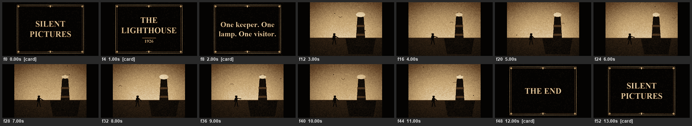

# Case study: a silent-film cinema and an art gallery, with no client mods

<p align="center"></p>

A player wanted a real cinema — a screening room where you sit down, the lights dim, a film actually plays on the
wall with music, and a few doors down an art gallery you can walk through. Neither needs a client mod, a shader, or
map art: the whole picture is a resource pack's item models, swapped on one `item_display` entity per screen or
wall. This page covers the design, why item-model frames beat the alternatives, the generation pipeline, and the
bugs found building it. The code is in [`resourcepacks/cinema/`](../resourcepacks/cinema) and
[`resourcepacks/gallery/`](../resourcepacks/gallery); the technique is
[`skill/pinkgolem/reference/cinema-and-gallery.md`](../skill/pinkgolem/reference/cinema-and-gallery.md).

| | |
|---|---|
| Cinema | one screening room, seats, a vanilla button, a subtitle strip, house lights that dim; `/cinema play <film>` |
| Demo film | "The Lighthouse", 14 s @ 4 fps, 56 played frames → 46 unique models, 0.35 MB packed, an original synthesised score |
| Gallery | four paintings (four different wall sizes), one spinning exhibit on a plinth, a sculpture plaque, a quiet zone |
| Built from | a Python toolkit (`cinemalib.py`) any film/gallery reuses: drawing, silent-film post-fx, RTL-safe text, frame dedupe, a resource-pack writer, and a tiny synth |
| Server cost | one entity per screen/painting, ever; a running film updates one entity's `item` component per changed frame |

---

## 1. Compare the options before building anything

A "screen" only needs to show one of N pre-decided pictures on cue. Four ways to do that in vanilla Minecraft, and
what each one actually costs:

| Method | Cost per frame | Resolution | Frame rate | Verdict |
|---|---|---|---|---|
| **Item-model frames**: an `item_display` whose `item` component names a different pre-baked model each frame | ~100 bytes — one item-metadata packet per viewer | any (texture-limited; 256x144 reads well) | any; wall-clock driven | **wins** — the pixels are baked once at build time, "playing" is just naming a model |
| Map art: an `item_frame` holding a `filled_map`, redrawn every frame | ~16 KB **per map per client per frame** (the whole image resent) | 128x128 per map | limited by bandwidth | a 4 fps film would resend megabytes a second per viewer |
| `text_display` "pixel art" (space-sized glyphs as pixels) | cheap | a practical ceiling around 64x36 "pixels" | fine for bars/text | too coarse to read as a picture |
| A wall rebuilt in blocks every frame | one block update per changed pixel, but re-meshes the whole chunk section | 1 pixel = 1 block | chokes above ~2 fps | a visible client hitch every frame, and each frame is a different build |

Item-model frames were the only option that scales to a real film. The real numbers from the first, longer film
built this way (75 s, 4 fps, 300 played frames): dedupe by content hash cut it to **~200 unique 256x144 PNGs,
~1.7 MB packed**. The short demo film shipped in this repo: 56 played frames, **46 unique, 0.35 MB**.

## 2. The pipeline

```
film_<id>.py            → FILM (metadata), CARDS (intertitles), render_frame(i), POSTERS
music_<id>.py            → render(path): an original score, synthesised, written straight to an Ogg
        ↓
gen_cinema_pack.py       → renders every played frame, dedupes by content hash into cinema:<id>_fNNNN models,
                            renders the score, writes sounds.json, draws posters, writes review images
        ↓
cinema.zip                → the resource pack part
scarpet-apps/cinema.data.example/films.json → id, title, fps, frame_models[], cards[], music, poster
        ↓
scarpet-apps/cinema.sc   → reads films.json + rooms.json, plays films, seats players, runs the dialog
```

**`Scene`** (in `cinemalib.py`) is a small supersampled grayscale drawing surface with a camera offset and a
"puppet" primitive (`figure()`): a silhouette person built from a handful of lines and polygons, parameterised by
arm angle, lean, legs vs. dress, hair, a cap — enough to act out a scene without needing actual artwork. **`finish()`**
turns any picture into the finished look: contrast, a vignette, per-frame flicker and grain, an occasional
scratch, an iris transition, and a quantise to a small sepia palette — this is what makes it read as an old film
rather than a flat cartoon.

**`FrameStore`** hashes every rendered frame (pixels + palette) and only keeps one copy of each distinct image,
recording the played sequence as a list of model ids. A held title card, rendered with two alternating "flicker"
variants (so it isn't a single frozen frame), still only costs 2 unique models no matter how long it's held.

## 3. Playing a film: a wall-clock frame index, not a tick counter

The screen is **one** `item_display` entity, spawned once and kept forever. Playing a frame merges a new `item`
component onto that same entity — item swaps on a display are not interpolated, so the new picture appears the
instant the packet lands, which is exactly right for stop-motion:

```
idx = floor((unix_time() - t0) * fps / 1000);
if (idx != R:'idx', ( R:'idx' = idx; modify(screen_entity, 'nbt_merge', '{item:{...,"minecraft:item_model":frames:idx}}') ));
```

Scheduling by `unix_time()` (wall clock) instead of a tick counter matters because the **music** is also real
playback time: if the server hitches for half a second, a tick-based index would fall behind the audio and the two
would drift apart for the rest of the film. Wall-clock scheduling self-corrects every tick.

## 4. Sound: three rules that fail silently if skipped

- **Mono, not stereo.** A `record`-category sound is positional (it fades with distance) only in mono; a stereo
  Ogg plays flat and centred everywhere, with no error to tell you it's wrong. `soundfile` writes mono Vorbis with
  no extra tooling — no ffmpeg needed.
- **`"stream": true`** in `sounds.json` for anything longer than a couple of seconds.
- **Volume above 1 only extends the audible range**, it does not get louder up close — a common misreading of the
  `sound()` call's volume argument.

The demo score is a simple pad-chord progression under a short piano melody, entirely procedural (no samples): a
resource-pack Ogg reaches every player who joins the server, so an actual recorded song is a licensing problem a
synthesised original melody never has to worry about.

## 5. RTL text: two different "text", one real bug

An intertitle card baked into a PNG frame is drawn with **PIL**, which has no bidi engine — a right-to-left script
(Hebrew, Arabic, ...) has to be reordered by hand (`cinemalib.visual()`: reverse the line, then un-reverse any
embedded Latin/number run so e.g. "Studio 1926" still reads left to right inside it). The **subtitle strip**
underneath, on the other hand, is a live Minecraft text component — the client does its own bidi, so it must get
the **logical** order, unreversed.

**The bug this project actually hit:** the demo film's cards are plain English. Running an all-English sentence
with punctuation ("One keeper. One lamp. One visitor.") through the RTL-reversal helper scrambled the clause
order into "One visitor. One lamp. One keeper" — the fix-up that restores a short embedded Latin phrase inside
Hebrew assumes exactly one separator character between words, and a reversed ". " (period+space) is *two* in a
row, which broke that assumption for a 100%-Latin sentence. The fix, now in `cinemalib.visual()`: detect whether
the line contains any RTL character at all, and return a pure-LTR line unchanged. A one-line regression this
project's own demo caught, before it ever reached the guide.

## 6. Positions, seats and stairs: measured, not guessed

- **A quad's position is the wall's FACE plus a small offset toward the viewers, never the block's own integer
  coordinate** — a block at z=Z spans z..z+1; a display centred at z is inside solid stone.
- **Seats:** an invisible `Marker` `armor_stand` is the actual seat entity; a rider's feet sit about 0.6 blocks
  *below* the stand's own y. Measured live once: `stand_y = seat_block_y + 0.5` puts the feet convincingly on the
  seat block, and that one offset (`seat_dy` in `rooms.json`) is reused for every seat in every room.
- **A stair used as a backrest:** its `facing` state is the side the BACK faces, not the way the seated player
  looks. A seat looking north needs `facing=south` — get it backwards and the backrest is in front of the sitter,
  which is exactly the mistake the first version of this project made (`lessons.md` #36).

## 7. Triggers: a plain button, not a custom model

Every button in the demo room is a plain vanilla button, polled every 2 ticks for its `powered` rising edge — no
resource-pack item, no interaction entity, so adding one more costs literally nothing. A custom item-model button
(a lift-call panel, say) is worth building for exactly one signature feature; reused everywhere, it makes every
button in the world look and behave the same and none of them read as special (`lessons.md` #39).

## 8. What went wrong, and how it was caught

- **The RTL-reversal bug above** — caught by actually generating the demo film and reading the contact sheet, not
  by inspecting the code. The first render showed "One .One keeper .One visitor" in plain sight.
- **A title card's longest word didn't fit its own card.** `wrap()` only breaks at word boundaries; "LIGHTHOUSE"
  set at the same size as the rest of the title card was wider than the card's text area and clipped past the
  ornamental frame. Fixed by sizing the title down until the single longest word measured under the wrap width —
  a check worth doing explicitly (`cl.text_width(font, longest_word) < wrap_width`) rather than eyeballing it.
- **Both bugs were visible in the first contact sheet**, before anything was ever loaded into a running server —
  the entire reason `gen_cinema_pack.py` writes review PNGs on every run.

## 9. Running it

- The screening room's entities are spawned once, guarded by a one-entity-per-tag lookup (`_one()`), and only when
  a real player is within range of the room — never blindly at server start when nobody may be near.
- A film is data (`films.json`) and a room is data (`rooms.json`); the scarpet app itself never changes when a new
  film or room is added, only the JSON and (for a film) one new Python module.
- The gallery reuses every one of these techniques for paintings, adds a spinning exhibit (any 3D item model, not
  just a flat quad) and a quiet zone that whispers once per player per visit.

## Lessons

- **Compare the real costs before picking a technique.** Map art and a rebuilt block wall both looked plausible on
  paper; the per-frame bandwidth and re-mesh cost ruled them out before a single frame was drawn.
- **Schedule anything timed against real audio by the wall clock, not a tick counter** — the two must be able to
  drift back into sync on their own after a hitch, not drift apart forever.
- **A generic library plus one small data file per instance.** `cinemalib.py` (or `gen_gallery_pack.py`'s drawing
  helpers) never changes for a new film or painting; only a new Python module and a `FILMS`/`PAINTINGS` entry do.
- **Render a review image and actually look at it, every time.** Both real bugs in this project were visible in
  the first contact sheet, not in the code — and would otherwise have shipped straight to a live audience.
- **Measure what you can't compute from first principles.** The seat's y-offset and the RTL card bug were both
  found by generating the real thing and looking at it, not by reasoning about NBT fields in the abstract.

## Files

| | |
|---|---|
| [`resourcepacks/cinema/cinemalib.py`](../resourcepacks/cinema/cinemalib.py) | the generic toolkit: `Scene`, `finish()`, RTL-safe text, `FrameStore`, `Pack`, the synth |
| [`resourcepacks/cinema/film_demo.py`](../resourcepacks/cinema/film_demo.py) / [`music_demo.py`](../resourcepacks/cinema/music_demo.py) | the working example film + score — the template for a new one |
| [`resourcepacks/cinema/gen_cinema_pack.py`](../resourcepacks/cinema/gen_cinema_pack.py) | the driver: renders, dedupes, packs, writes review images |
| [`resourcepacks/gallery/gen_gallery_pack.py`](../resourcepacks/gallery/gen_gallery_pack.py) | four demo paintings + a spinning exhibit, and `art.json` |
| [`scarpet-apps/cinema.sc`](../scarpet-apps/cinema.sc) / [`gallery.sc`](../scarpet-apps/gallery.sc) | the rooms: seats, buttons, dialog, playback, quiet zones |
| [`skill/pinkgolem/reference/cinema-and-gallery.md`](../skill/pinkgolem/reference/cinema-and-gallery.md) | the technique as a step-by-step reference page |
