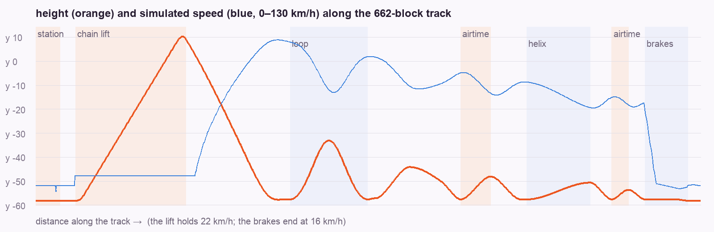
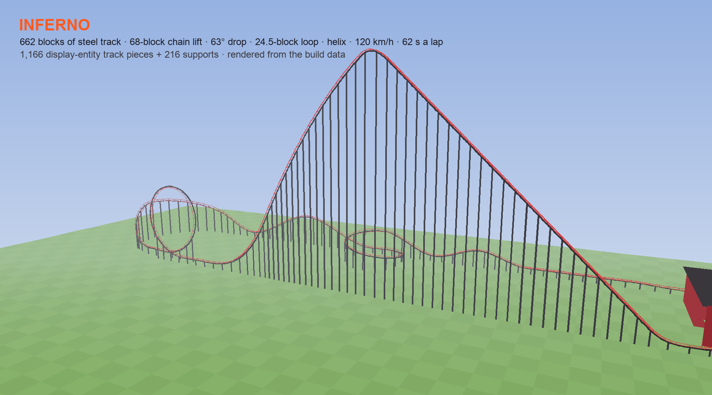

# Case study: an AI builds a roller coaster that really runs

<p align="center"></p>

A player asked for *"an amazing roller coaster next to the stadium, with a loop, a high lift hill and a real coaster
feeling — ridden in first person, a red train with orange flames"*. This page follows how the AI built it with
ClawdBlock in one evening. It covers the design, the physics, the track, the train and the camera, and the bugs found
along the way. The code is in [`skill/clawdblock/blueprints/coaster/`](../skill/clawdblock/blueprints/coaster) and the
technique pages are in [`reference/rides.md`](../skill/clawdblock/reference/rides.md).

| | |
|---|---|
| Track | 662 blocks of smooth steel track: station, 68-block chain lift, 63° first drop, 24.5-block teardrop loop, banked climbing 180°, airtime hill, banked helix around a flame tower, bunny hop, brakes |
| Ride | 62 s a lap, 120 km/h top speed, about 9 G at the bottom of the loop, −2.7 G of airtime, 5 cars with one rider each |
| Built from | 1,166 display-entity track pieces + 216 supports (not blocks), a 7 KB resource pack for the train, one scarpet app |
| Server cost | the static track is free while nobody is near; a running train moves 15 entities a tick |

---

## 1. Design the path before placing a block

A coaster is a 3D curve. Freehand control points make kinks and self-intersections, so the path is drawn by a
**turtle**. Each command moves it forward in the horizontal plane (straight, or turning at a fixed radius) while the
height follows a **cubic Hermite curve** between the end heights and end slopes. Heading and slope are continuous at
every joint, so the ride never jolts at a seam.

```python
t = Turtle(x=-10, y=-58, z=368, yaw=270)                  # station, heading east
t.seg(24, tag="station")
t.seg(15.7, turn=90, tag="tyres")                           # right turn, r 10
t.seg(66, y1=7.2, m1=0.95, tag="lift")                      # 43° chain lift
t.seg(9, y1=9.0, m1=-0.9, tag="lift")                       # crest
t.seg(34, y1=-40.0, m1=-2.0)                                # first drop
t.seg(30, y1=-57.5, m1=0.0)                                 # pull-out
t.loop(16.0, 8.5, 3.0)                                      # teardrop loop, drifting 3 blocks sideways
...
rest = t.z - (START_Z + 8)                                  # whatever straight is left closes the circuit exactly
t.seg(rest - 12, tag="brakes")
```

The **loop** is its own element. The tangent angle θ runs 0 → 2π while the radius shrinks from 16 at the bottom to 8.5
at the top, which gives the teardrop of real loops: gentle where it's fast, tight where it's slow. A small sideways
drift lets the exit pass next to the entry. The path is sampled every 0.1 block, then **resampled every 0.5 block of 3D
arc length**. From then on, "distance along the track" is just `index × 0.5`, which is what the ride app needs.

The first layout came back 84 blocks short of closing, so the last straight is now computed from where the turtle
stands, and the circuit closes to 0.19 blocks.

## 2. Physics first, in Python

Before building anything, a simulator runs the train around the design at 20 steps a second, the same way the app will:

- gravity 0.0245 blocks/tick² (real *g* when 1 block = 1 m), quadratic drag and rolling resistance;
- the train's slope is the **mean over its cars**, so it speeds up as the cars pass a crest, like a real train;
- the chain lift holds 0.30 b/t (22 km/h) while any car is on it, tyres push 0.2 b/t in the station, and brakes bleed
  to 0.22 b/t.

It reports stalls, top speed, lap time and G forces for every design change. It caught the airtime hills first: a
16-block hill made −25 G, because a Hermite hump with flat ends curves hardest at its ends. Longer, lower hills fixed it.

<p align="center"></p>

**A bug the numbers exposed.** The simulator turned the slope into a sine twice. Since the samples are already 3D arc
length apart, `Δy / 0.5` *is* sin(pitch), and dividing again by √(1+s²) hid 13% of gravity on the steep parts. Fixing
it raised the top speed from 109 to 122 km/h and changed every bank angle, so the whole track was rebuilt. **Banking
comes from the simulated speed** (`atan(v²·κ / g)`, smoothed over 6 blocks, capped at 72°), so the rails and the
train's roll must come from the same numbers.

Each sample gets a frame: forward *f*, up *u* (world-up made perpendicular to *f*, then rolled by the bank angle; in the
loop it points at the loop's centre) and left *l = u × f*. That frame becomes a quaternion, which is everything the
track and the train need.

## 3. A smooth track made of display entities

A block track looks like stairs, and it can't lean into a curve. Instead, every rail piece is a
**`block_display` box stretched and rotated along the curve**:

```python
# a box from point a to point c: length along f, top toward u
f = norm(c - a); u = up ⟂ f; l = u × f
q = quat(l, u, f)                                   # columns l, u, f → the display's left_rotation
translation = -(l*w/2 + u*h/2 + f*len/2)            # the box is centred on the entity
summon block_display <midpoint> {block_state:{Name:"red_concrete"}, transformation:{left_rotation:q, scale:[w,h,len], translation:...}}
```

Pieces are cut adaptively. A box grows along the curve until its chord strays more than 0.035 blocks or it reaches 6
blocks, so straights are long boxes and the loop is many short ones. Two red rails, a black box spine and ties every
2.5 blocks make 1,166 pieces. Supports are black columns, placed only where no other part of the track runs
underneath; the lift gets an A-frame trestle. Display entities cost the server almost nothing when nobody is near. The
track is the densest spot for players' frame rate, so it was built once and never re-summoned.

<p align="center"></p>

## 4. The train

Each car is an **`item_display` with a custom item model** from a small resource pack. The two models (a front car
with a flame hood and a crest of flame tongues, and a middle car with fins and exhausts, duplicated four times) are
generated in Python, including their textures drawn pixel by pixel: red paint, flames licking back from the nose,
black bucket seats with orange stitching. `model_preview.py` renders them to a PNG, so the design is checked without
opening the game.

Every tick the app sets each car's `transformation.left_rotation` to the quaternion at its place on the track. The
cars bank, climb, and **really go upside down** through the loop. Display interpolation (`teleport_duration: 1`,
`start_interpolation: 0`) makes it smooth on every client.

**The purple cube.** After the first deploy the front car showed Minecraft's missing-model cube, and the middle cars
were fine. The JSON was valid, so the AI **bisected in the game**:
- It put four variants of the front car into the pack, each without one feature (windscreen, flame crest, rotated
  parts, lights).
- It pushed the pack live to the player with Key Bridge's `/packpush`, with no restart.
- It stood the variants in a row and asked which ones looked right.

Every variant with the windscreen broke: its semi-transparent texture. It was removed, and the fix went live the same
minute.

## 5. Riding it: the camera took four tries

1. **Riding a seat entity.** The rider sits on an invisible display moved every tick. A seated player's eye is exactly
   1.02 above the entity they ride, which was measured with a test player, not guessed. It is smooth, but the mouse
   looks around freely.
2. **The player wanted a locked, first-person camera and no text on screen.** Now the rider becomes a *spectator of a
   camera entity* at their eye, facing along the track. A mannequin with their skin sits in the car so others still
   see them.
3. **"My own head blocks the view."** The camera moved 0.6 blocks ahead of the mannequin's head.
4. **"The camera doesn't turn over in the loop."** Minecraft cameras have no roll, and the server clamps a camera's
   pitch to ±90°. The first answer kept the yaw fixed through the loop and let only the pitch swing (sky, horizon,
   ground), which avoids a 180° flip but isn't upside down. The real answer uses two facts:
   - When you spectate a spider, the client applies the `spider` post effect. A resource pack can replace it with a
     **180° image rotation**, which is exactly an upside-down view.
   - The server runs on Peaceful, where spiders can't exist. So the Key Bridge mod shows the rider a **fake spider made
     only of packets**, which never exists on the server, and points their camera at it while their car is inverted.

   At the switch points the camera looks straight up or down, and a 180° yaw change plus a 180° image roll give the
   *same* picture, so the switch is seamless. The mod side is tested on a server; the first ride on a real client is
   the next test.

## 6. Testing it on a live server

The server had players on it the whole time, so nothing was tested by "reload and hope":

- **`minecraft_playtest`** rode full laps with Carpet fake players and asserted each step: dispatch after the
  countdown, still seated after the rider pressed Shift, through the loop, landed on the exit platform in their old
  game mode, and the camera and mannequin removed. It cleans up after itself, including the fake players' records and
  saved files.
- One of those tests found a real bug: a countdown left over with no riders stuck at 0 and would have blocked the next
  train.
- Another found a **testing trap**. Fake players drift away from a camera they spectate, but real players don't. So
  "distance to the camera" can't mean "the rider left". Shift now comes from Key Bridge's key scoreboard.
- Live changes went through `minecraft_app patch`: a function replaced in the running app, state kept, the file
  updated. Lint ran before every change.

## 7. Running it

- The train exists only while a real player is near the station. It carries a generation tag, and older copies are
  removed when their chunk loads, so a restart never leaves a frozen duplicate.
- The track's chunks are force-loaded only while a train runs, so an empty show run doesn't freeze halfway.
- Riders carry a tag and a saved game mode. After a reload or a crash mid-ride they are put back on the exit platform
  in their own mode.
- An empty "show run" starts every 45 s when someone is watching and nobody is riding.

## Lessons

- **Simulate before you build.** A 200-line Python model found the stalls, the G spikes, the missing gravity and the
  unclosed circuit, none of which would have been visible until someone rode it.
- **One source of truth.** Banking comes from the simulated speed, and the rails, the train roll and the app all read
  the same samples. Changing the physics means rebuilding the track.
- **Display entities are the building material for anything curved.** A box per chord, rotated by a quaternion,
  scaled to size.
- **Measure what you can't see.** Rider eye height, model orientation and the missing-model cause were all measured or
  bisected, not assumed.
- **The player's taste drives the camera.** Free look was technically nicer; a locked first-person view with no HUD
  was what they wanted. The upside-down loop took a mod and a shader, and was worth it.
- **Test like the players play.** Scripted fake riders, then the owner's own laps and feedback.

## Files

| | |
|---|---|
| [`blueprints/coaster/track.py`](../skill/clawdblock/blueprints/coaster/track.py) | turtle path, loop, resampling, physics simulation, banking, frames |
| [`blueprints/coaster/build.py`](../skill/clawdblock/blueprints/coaster/build.py) | track displays, supports, station, `track.json` for the app |
| [`blueprints/coaster/pack.py`](../skill/clawdblock/blueprints/coaster/pack.py) | the train's models and textures |
| [`blueprints/coaster/coaster.sc`](../skill/clawdblock/blueprints/coaster/coaster.sc) | the ride: physics, cars, riders, camera, effects, stats |
| [`resourcepacks/tools/model_preview.py`](../resourcepacks/tools/model_preview.py) | render item and block models to PNG without a game client |
| [`mods-src/keybridge/`](../mods-src/keybridge) | keys → scoreboard, `/packpush`, and the flip camera |
| [`reference/rides.md`](../skill/clawdblock/reference/rides.md) | the techniques as a reference page |
