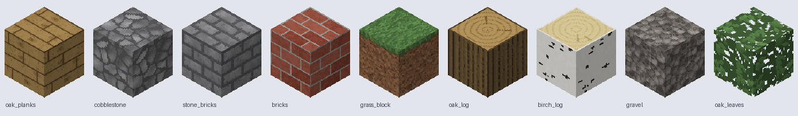

# Natural block textures, generated



25 block textures in a natural, near-vanilla look, drawn by code at any resolution: four woods (planks, bark, log
tops with rings), stone, smooth stone, cobblestone, stone bricks, bricks, dirt, sand, gravel, grass (biome-tinted),
oak leaves and glass. Everything tiles.

```bash
pip install numpy scipy pillow
python3 resourcepacks/textures/build_pack.py 32 --pixel=8     # → natural_32_p8/ + natural_32_p8.zip
python3 resourcepacks/tools/block_render.py oak_planks grass_block --pack resourcepacks/textures/natural_32_p8.zip --compare
```

- `res`: 16, 32, 64 … (feature sizes scale with it).
- `--pixel=N`: pixel-art shading, N tones per texture. 8 looks clearly pixel-art; leave it out for smooth shading.
- Ready: `natural_32.zip` (smooth) and `natural_32_p8.zip` (8 tones), resource pack format 88 (Minecraft 26.2).

Use it as a normal resource pack, or add the zip to your server pack's parts and deploy it with `minecraft_pack`.
How it works and how to design more: [reference/textures.md](../../skill/clawdblock/reference/textures.md).
